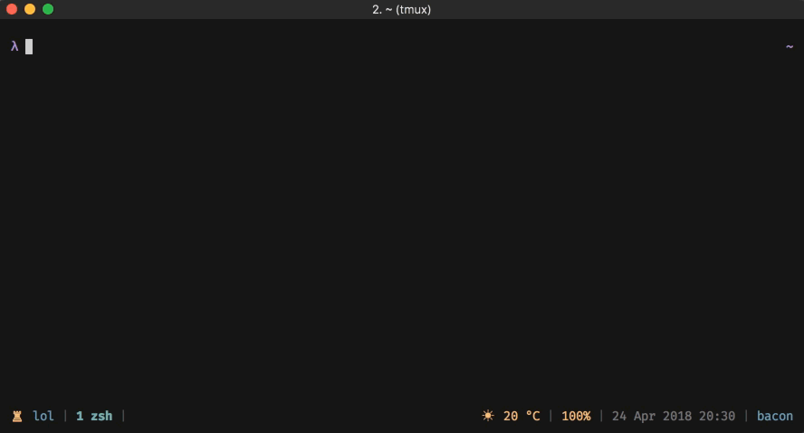

# tmux-1password

> Access your 1Password login items within tmux!



This plugin allows you to access you 1Password items within tmux, using 1Password's CLI. It works
for personal 1Password accounts, as well as teams accounts.

## Requirements

This plugin relies on the following:

- [1Password CLI](https://support.1password.com/command-line-getting-started/)
- [fzf](https://github.com/junegunn/fzf)
- [jq](https://stedolan.github.io/jq/)

## Key bindings

In any tmux mode:

- `prefix + u` - list login items in a bottom pane.

## Install

### Using [Tmux Plugin Manager](https://github.com/tmux-plugins/tpm) (recommended)

1. Add plugin to the list of TPM plugins in `.tmux.conf`:

    ```
    set -g @plugin 'yardnsm/tmux-1password'
    ```

2. Hit `prefix + I` to fetch the plugin and source it. You should now be able to use the plugin.

### Manual Installation

1. Clone this repo:

    ```console
    $ git clone https://github.com/yardnsm/tmux-1password ~/some/path
    ```

2. Source the plugin in your `.tmux.conf` by adding the following to the bottom of the file:

    ```
    run-shell ~/some/path/plugin.tmux
    ```

3. Reload the environment by running:

    ```console
    $ tmux source-file ~/.tmux.conf
    ```

## Usage

First, sign in with 1Password CLI by running the following in your terminal (you only need to do
this *once*):

```console
$ op signin <signinaddress> <emailaddress> <secretkey>
```

For 1Password personal accounts, `<signinaddress>` should be `my.1password.com`. If you're using a
team account, configure the [`@1password-subdomain`](#setting-the-signin-subdomain) option.

From now on, initiate the plugin by using the keybind (`prefix + u` by default). A new pane will be
opened in the bottom, listing the appropriate login items. Press `<Enter>` to choose a login item,
and its password will automatically be filled.

You may be required to perform a re-login (directly in the opened pane) since the 1Password CLI's
sessions expires automatically after 30 minutes of inactivity.

### Configuring login items in 1Password

In order to show only relevant login items and to maintain compatibility with
[sudolikeaboss](https://github.com/ravenac95/sudolikeaboss), its required to set the value of the
`website` field for each login item with the value of `sudolikeaboss://local`.


## Configuration

Customize this plugin by setting these options in your `.tmux.conf` file. Make sure to reload the
environment afterwards.

#### Changing the default key-binding for this plugin

```
set -g @1password-key 'x'
```

Default: `u`

#### Setting the signin subdomain

```
set -g @1password-subdomain 'acme'
```

Default: `my`

## Prior art

Also see:

- [sudolikeaboss](https://github.com/ravenac95/sudolikeaboss)

---

## License

MIT © [Yarden Sod-Moriah](http://yardnsm.net/)
